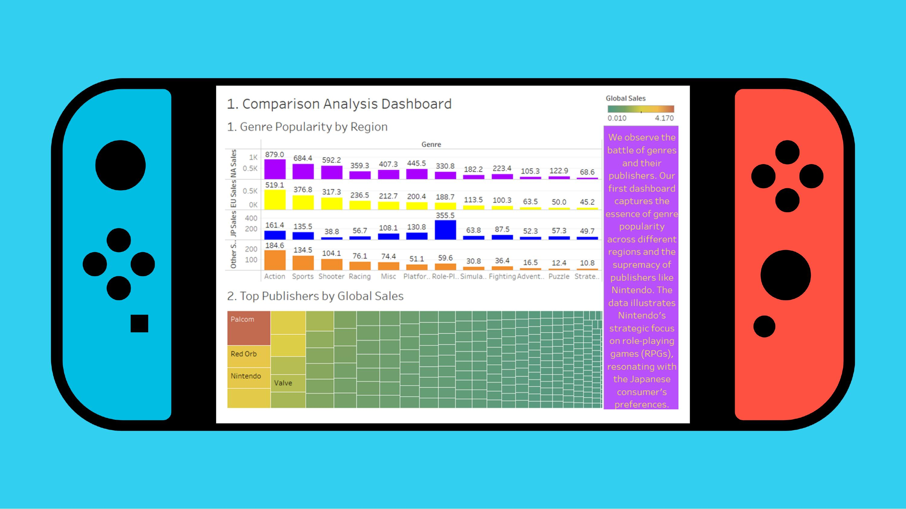
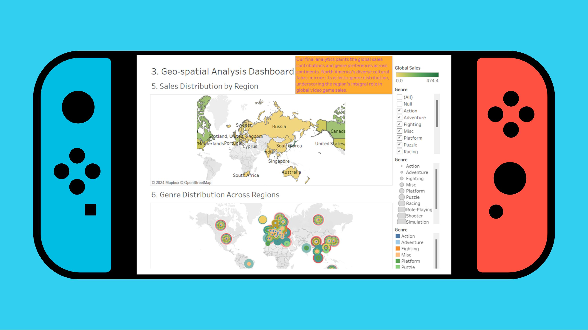

# Video Game Trends Analysis

**Data Visualization Project | Global Video Game Sales 1980 to 2016**

A data visualization project analyzing over 16,000 video game titles to uncover genre preferences, publisher dominance, platform market shifts, and regional sales patterns across four decades of the global gaming industry. Built using Tableau.

---

## The Problem

The video game industry generates billions in annual revenue across dozens of platforms, genres, and regions. Yet understanding what players actually want and where requires more than intuition.

This project asks: what does 40 years of sales data tell us about how gaming preferences differ across cultures, and how platforms rise and fall over time?

---

## Analysis Questions

1. How does the popularity of game genres differ between North America, Europe, Japan, and the rest of the world?
2. Which publishers dominate the video game market globally?
3. How has the market share of different gaming platforms changed over the last four decades globally?
4. How do critic and user ratings affect video game sales over time globally?
5. What is the distribution of video game sales across North America, Europe, Japan, and the rest of the world?
6. How does the distribution of game genres vary across regions globally?

---

## Dataset

| Field | Detail |
|---|---|
| Source | Kaggle: Video Game Sales Dataset |
| Records | 16,720 video game titles |
| Coverage | 1980 to December 2016 |
| Fields | Game title, platform, year of release, genre, publisher, regional sales (NA, EU, JP, Other), global sales, critic score, critic count, user score, user count, developer, content rating |

A supplementary dataset was built to add publisher and developer location data (country/region) to enable the geo-spatial map visualization, as this information was not available in the original dataset.

---

## Tool Used

**Tableau**: all dashboards, charts, and visualizations built in Tableau Desktop.

Three dashboard types produced:
- Comparison Analysis Dashboard
- Time Series Analysis Dashboard
- Geo-spatial Analysis Dashboard

---

## Screenshots

### Comparison Analysis Dashboard

*Genre popularity by region and top publishers by global sales. Action dominates in North America and Europe while Japan's preference for role-playing games drives Nintendo's outsized influence among top publishers.*

---

### Time Series Analysis Dashboard

*Platform market share across four decades and the impact of critic and user ratings on sales over time. Nintendo's sustained dominance across console generations stands out, with Grand Theft Auto V and Wii Sports anchoring the ratings-to-sales relationship.*

---

### Geo-spatial Analysis Dashboard

*Global sales distribution by region and genre spread across continents. North America emerges as the largest contributor to global video game sales, with its cultural diversity reflected in an even spread across all genre categories.*

---

## Key Findings

- Japan strongly prefers the role-playing game genre while North America and Europe favor action games
- Nintendo consistently ranks among the top global publishers, with its RPG catalog directly tied to Japanese consumer preferences
- Platform market share analysis across four decades shows Nintendo's sustained relevance through multiple console generations
- North America's cultural diversity is reflected in its broad consumption of all game genres, making it the largest single contributor to global video game sales
- Critic and user ratings show a positive correlation with sales performance, with top-rated titles clustered among the highest global sellers

---

## Repository Structure

```
Video-Game-Trends-Analysis/
├── data/
│   ├── Video-Games-Sales-1980-to-2016.csv               # Primary dataset (Kaggle)
│   └── Developer-Location-Supplementary.xlsx            # Supplementary geo dataset
├── screenshots/
│   ├── screenshot-comparison-dashboard.jpg              # Comparison Analysis Dashboard
│   ├── screenshot-time-series-dashboard.jpg             # Time Series Analysis Dashboard
│   └── screenshot-geospatial-dashboard.jpg              # Geo-spatial Analysis Dashboard
├── Video-Game-Trends-Tableau.twbx                       # Tableau workbook
├── Video-Game-Trends.pdf                                # Full presentation deck
└── README.md
```

---

## Acknowledgements

- **Andy Bramwell** – *Discovering Hidden Trends in Global Video Games* [Data set] (Kaggle, 2020) – primary dataset source  
  https://www.kaggle.com/datasets/thedevastator/discovering-hidden-trends-in-global-video-games

---

## Author


**Juan Carlos Katigbak**

All analysis, dashboard design, and data narrative were completed in Tableau.

[LinkedIn](https://linkedin.com/in/juan-carlos-katigbak) | [GitHub](https://github.com/juancarloskatigbak8)
